# brain-tumor-detection

<strong>Brain Tumor Detection System</strong>  
This `README.md` file is structured as follows:
1. Repository structure
2. Introduction
3. Dataset
4. Approaches and results
5. UI Application
6. Requirements and installation
7. Technical details / Execution
8. References


# Repository structure
```
brain-tumor-detection
├─ .gitignore
├─ Images
│  ├─ CNN_System_Architecture.png
│  ├─ UI_app
│  │  ├─ img1.png
│  │  ├─ img10.png
│  │  ├─ img2.png
│  │  ├─ img3.png
│  │  ├─ img4.png
│  │  ├─ img5.png
│  │  ├─ img6.png
│  │  ├─ img7.png
│  │  ├─ img8.png
│  │  └─ img9.png
│  ├─ UNet_System_Architecture.png
│  ├─ classification_cm.jpg
│  └─ segmentation_train_val_curves.jpg
├─ README.md
└─ brain-tumor-detection
   ├─ README.rst
   ├─ brain_tumor_detection
   │  ├─ __init__.py
   │  ├─ app
   │  │  └─ app.py
   │  ├─ brain_tumor_classification
   │  │  ├─ model.py
   │  │  ├─ predict.py
   │  │  └─ train.py
   │  ├─ brain_tumor_segmentation
   │  │  ├─ generate_masks.py
   │  │  ├─ model.py
   │  │  └─ train.py
   │  └─ utils
   │     └─ utils.py
   ├─ poetry.lock
   ├─ pyproject.toml
   └─ tests
      ├─ __init__.py
      └─ test_brain_tumor_detection.py
```


# Introduction
In this repository, a detection and segmentation method for brain tumors was developed using MRI images as input to deep learning networks for the examination of the presence of a tumor in the brain and the identification of the tumor area.


# Dataset
The dataset that was used is the <em>Br35H :: Brain Tumor Detection 2020</em>. Br35H is a proper dataset for both tasks as it contains tumorous & non tumorous images for the detection part and all the necessary information to produce the segmentation masks for the segmentation task. The dataset can be found [here](https://www.kaggle.com/datasets/ahmedhamada0/brain-tumor-detection). The dataset contains 3 folders: yes, no which is the training set (3000 Brain MRI images) and pred which is the testing set (60 Brain MRI images without labels). The dataset is not uploaded on the repo. However, the dataset is described below and as we can see it is fully balanced.

## Table 1. Brain tumor detection task
| Folder      | Description |
| ----------- | ----------- |
| Yes | The folder yes contains 1500 Brain MRI Images that are tumorous |
| No | The folder no contains 1500 Brain MRI Images that are non-tumorous |
| Pred | The folder contains 60 Brain MRI images without label |

## Table 2. Brain tumor segmentation task - Description of Br35H-Mask-RCNN folder
| Folder      | Description |
| ----------- | ----------- |
| TRAIN | The folder contains 500 Brain MRI Images that are tumorous for train set. <br/> It contains also the `annotations_train.json` ... |
| VAL | The folder contains 201 Brain MRI Images that are tumorous for validation set. <br/> It contains also the `annotations_val.json` ... |
| TEST | The folder contains 100 Brain MRI images that are tumorous for test set. <br/> It contains also the `annotations_test.json` ...|
| annotations_all.json| A file for creating the segmentation masks. It specifies the pixels for each MRI which are part of a brain tumor area. |


# Approaches and results
The main goals are to: 
 - classify the brain in the presence of a brain tumor or a healthy brain and (binary classification)
 - find the exact tumor area (segmentation)

## Classification
In this approach an architecture that uses a convolutional neural network for brain
tumour detection is built. The CNN architecture that was built in the first approach is proposed in Chattopadhyay et al. [[1]](#reference1).

### Image preprocessing
- Images are loaded as coloured (RGB/3 channels). This is a prerequisite for the model architecture to work.
- Each colour channel is resized to (128 pixels, 128 pixels).

### Experimentation and validity
- Experimentation is done using StratifiedKfold method (10 splits).
- The dataset is splitted into 10 non overlapped folds of images preserving the
percentage of samples for each class as much as possible as it was in the initial
dataset.
- In each iteration 9 folds are used for training and the rest as testing set. The
experiment ends when all 10 folds have been placed in the test position. In other
words, in each iteration the 90% of the initial dataset is used for training and the
remaining 10% is used for testing.
- All images will be at testing position in circular manner.
- Model hyperparametes: epochs=10, batch_size=32, learning_rate=0.0001
(RMSprop optimizer)
- In the proposed architecture of the Chattopadhyay et al. [[1]](#reference1) at the final dense layer, Softmax is applied as activation function with 2 units. In the architecture that is implementd in the current repository, the activation of the final dense layer is replaced by a Sigmoid with 1 unit.

Below is shown the system architecture.  
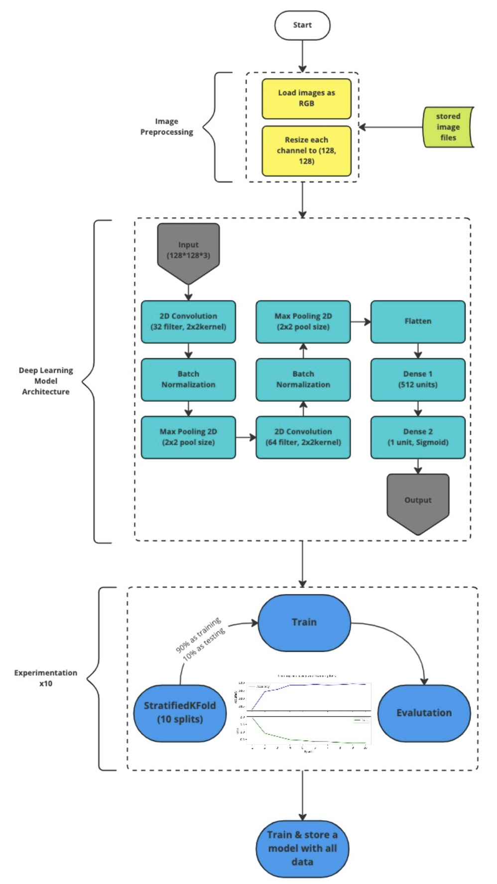*CNN Classification System Architecture*

### Aggregated classification results of StratifiedKFold experiment.
- The model performs 96.0% of accuracy.
- Predicted correct 1455/1500 (97.0%) out of non-tumorous brain images.
- Predicted correct 1425/1500 (95.0%) out of tumorous brain images.

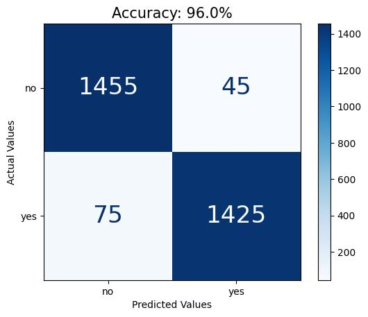*Confusion Matrix representing the results of Classification experiment*

## Segmentation
In this approach, the traditional architecture of U-Net is used for brain tumor
segmentation. The U-Net architecture that was used is proposed in Ronneberger et al. [[2]](#reference2).

### Image preprocessing:
- Images are loaded in grayscale (1 channel).
- Images are resized to (128 pixels, 128 pixels).
- Pixels normalisation is performed (0-255 to 0-1).

### Experimentation and validity
- The dataset is divided by default into training, validation and testing set.
- For the training procedure Early Stopping is used, which is a regularisation technique for deep neural networks that stops training when a parameter updates, no longer begin to yield improvements on a validation set.
- In the proposed architecture of the Ronneberger et al. [[2]](#reference2), the initial number of features is 64. In the architecture that is implementd in the current repository, the initial number of features is 16.
- Model hyparameters: max number of epochs = 100, batch size = 32, learning rate =
0.0005 (RMSprop optimizer)

Below is shown the system architecture.  
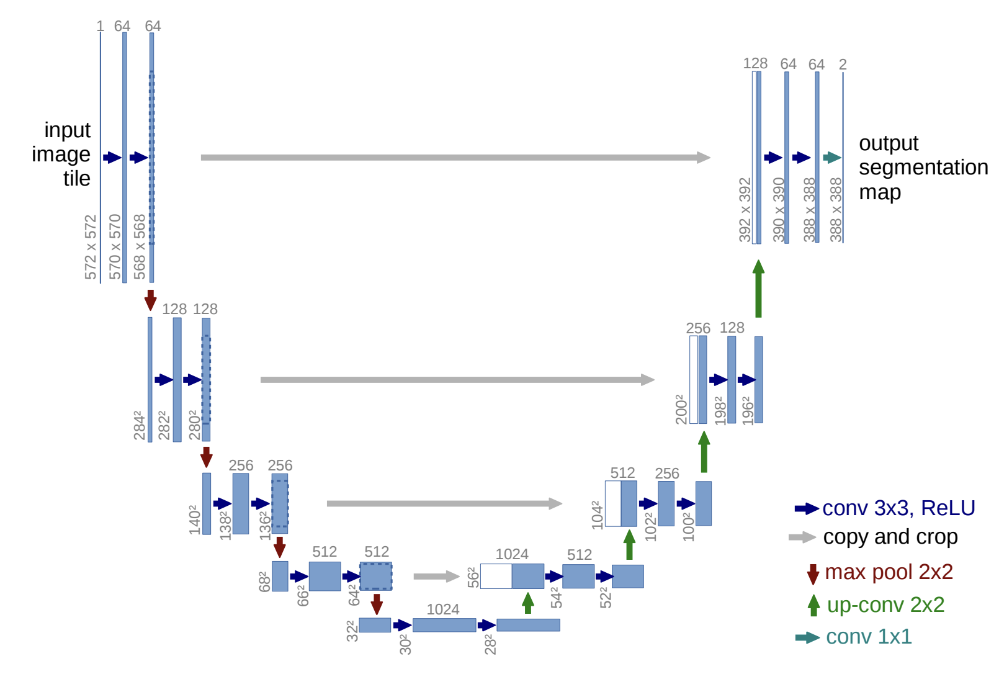*U-Net Segmentation System Architecture*

### Segmentation results
Below are shown the train and validation curves for accuracy and loss during training procedure. As we can see, the early stopping method puts an end on the training procedure after 30 epochs.  
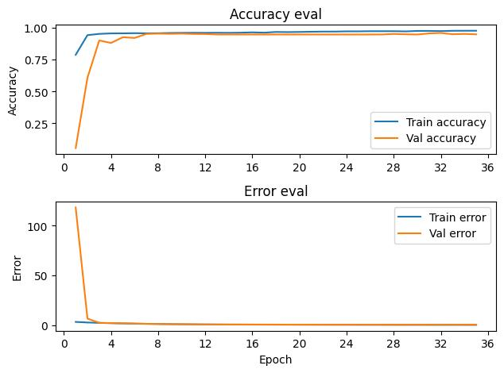*Train and validation curves*

- The testing loss is 0.23.
- The testing accuracy is 94.31% (classification of each pixel).


# UI Application
Additionally, a UI Streamlit app was created, in order for a user to use the trained models for brain tumor classification and segmentation in MRI images. Below is proposed the use of the app step by step.

Step 1: Below is shown the starting page of the UI App.  
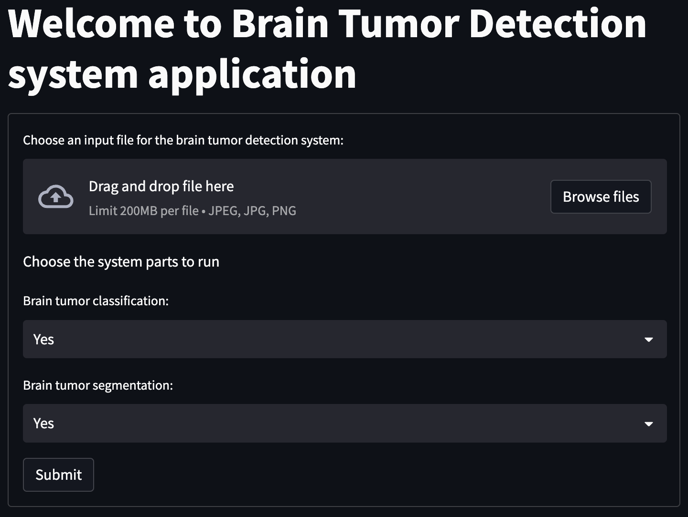

Step 2: The user selects "Broswe files" in order to select the image to analyze.
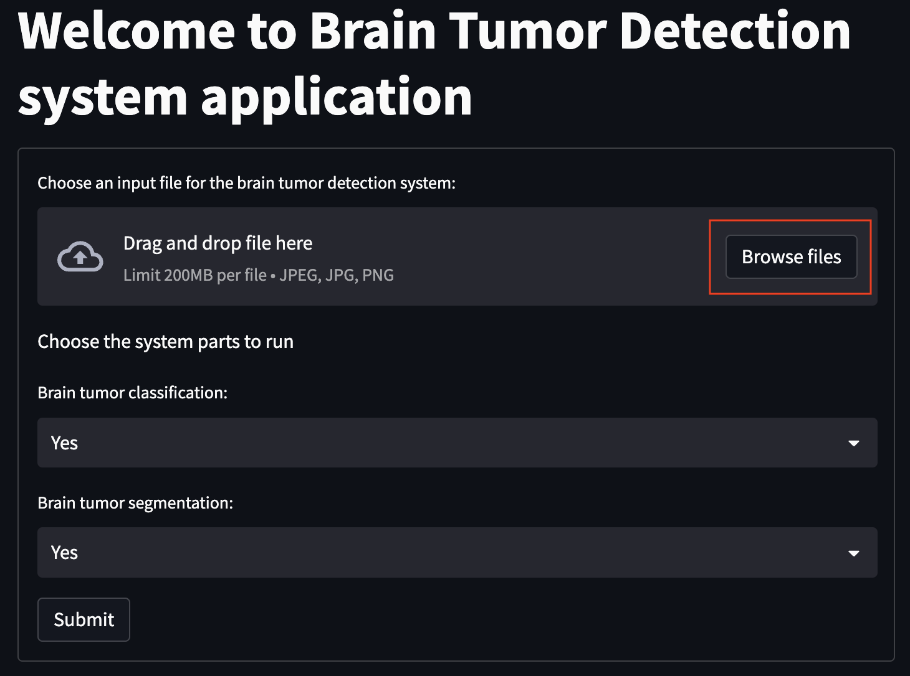

Step 3: The image to be analyzed is loaded.
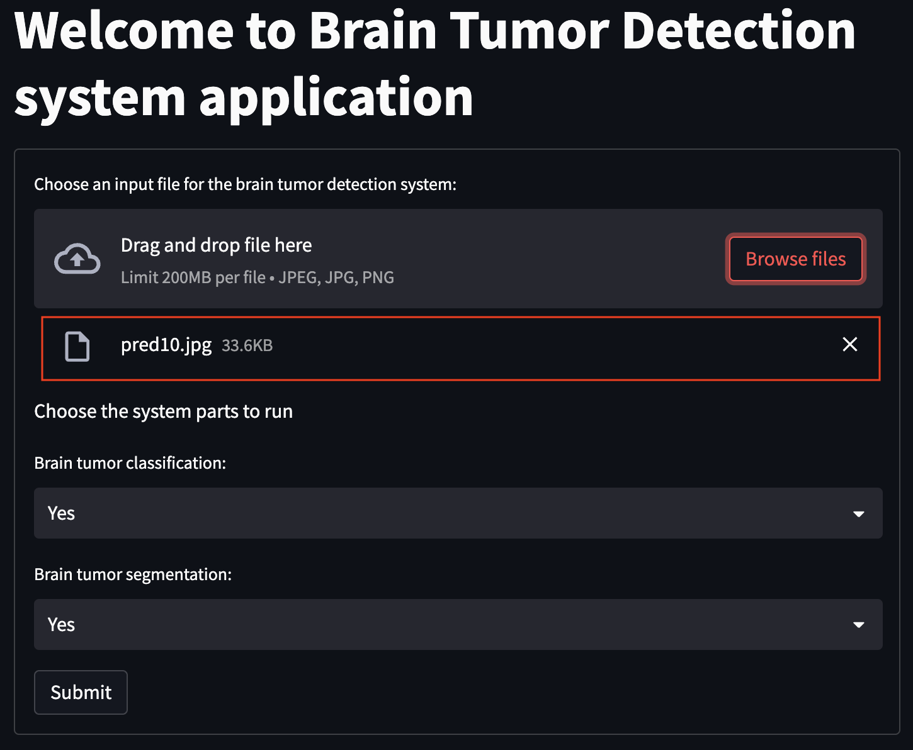

Step 4: The user selects if classification will be performed.
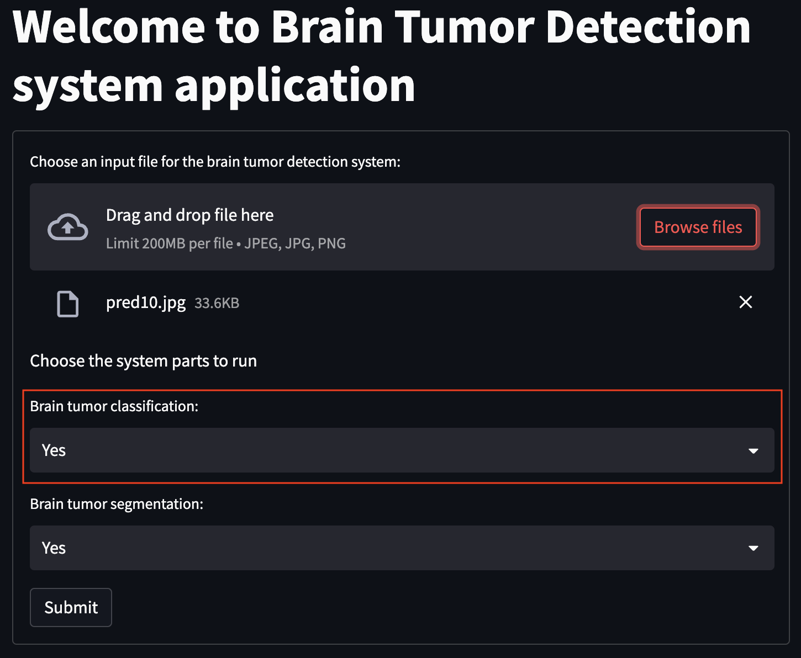

Step 5: The user selects if segmentation will be performed.
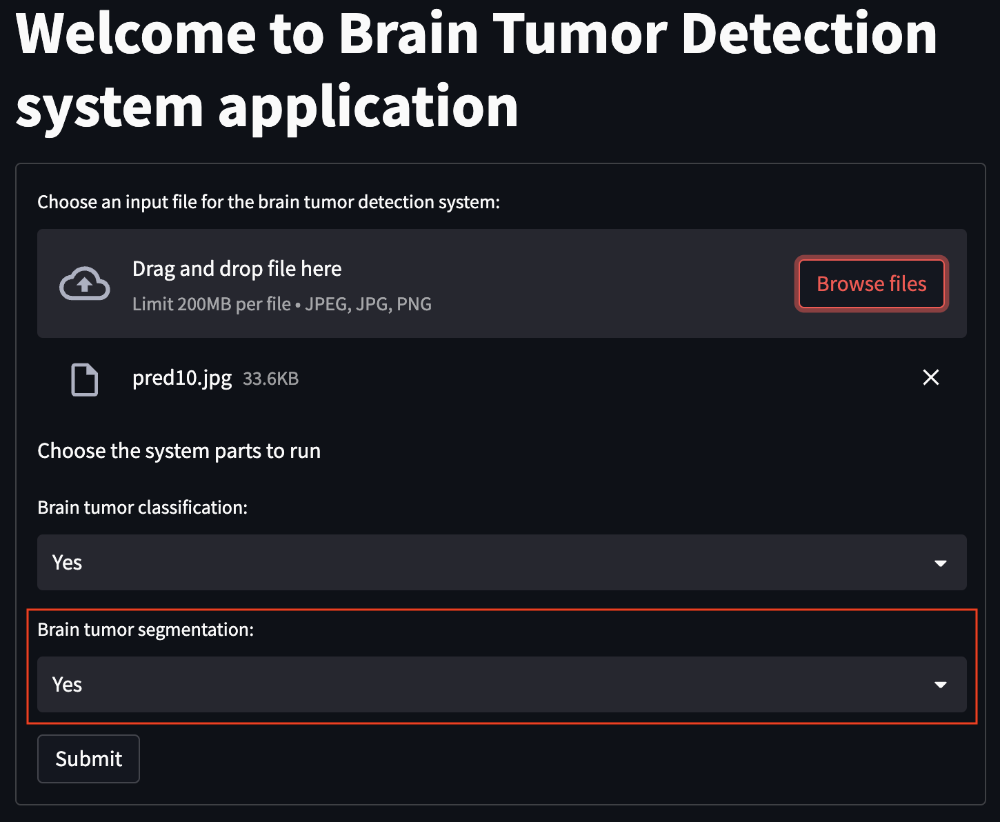

Step 6: The user clicks "Submit" in order for the analysis process to start.
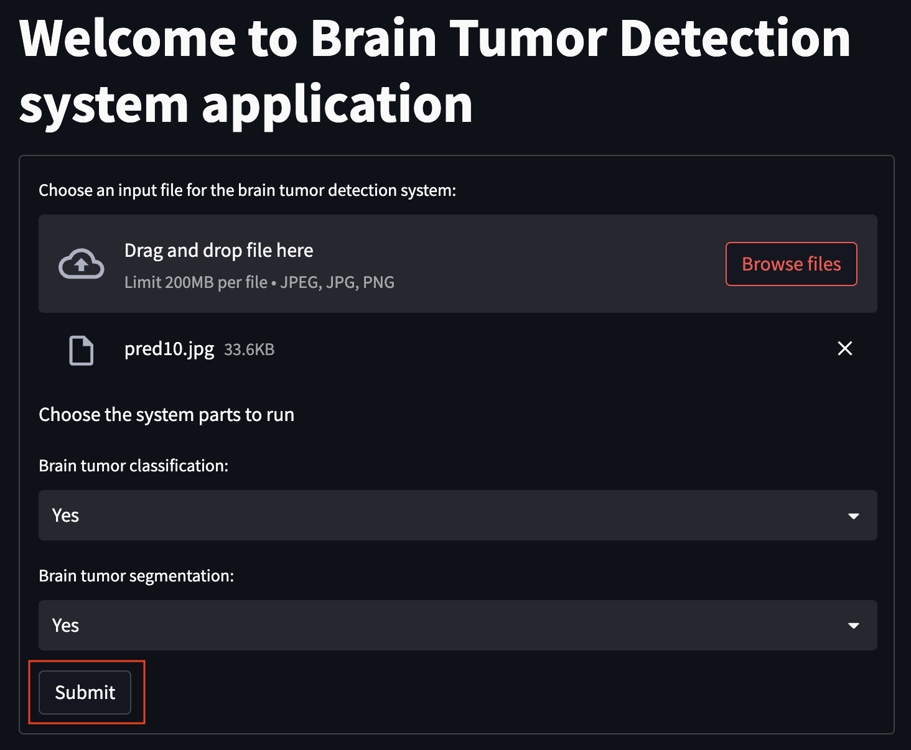

Step 7: The message "Successfully submitted", informs the user that the image and the selections were applied successfully.
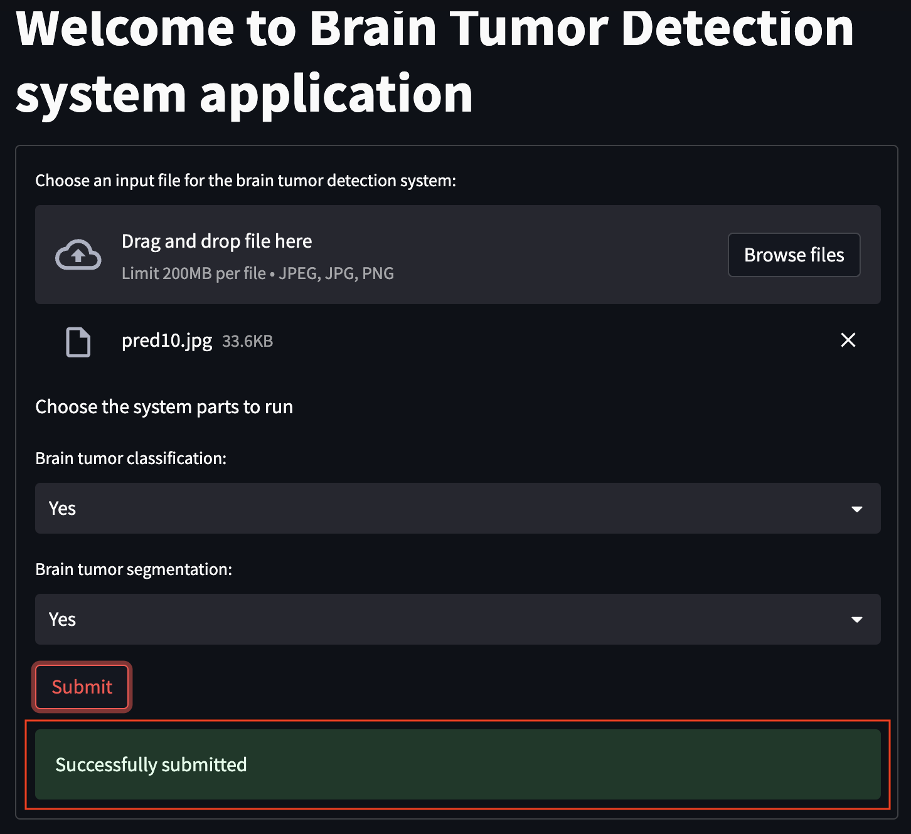

Step 8: Classification results are printed.
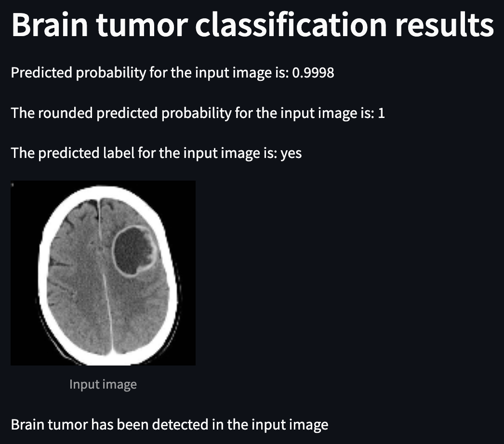

Step 9: Segmentation results are printed.
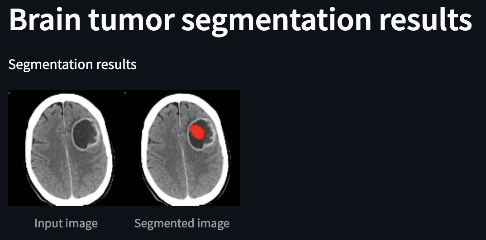

Step 10: Finally, all of the app's functionalities are summarized below.
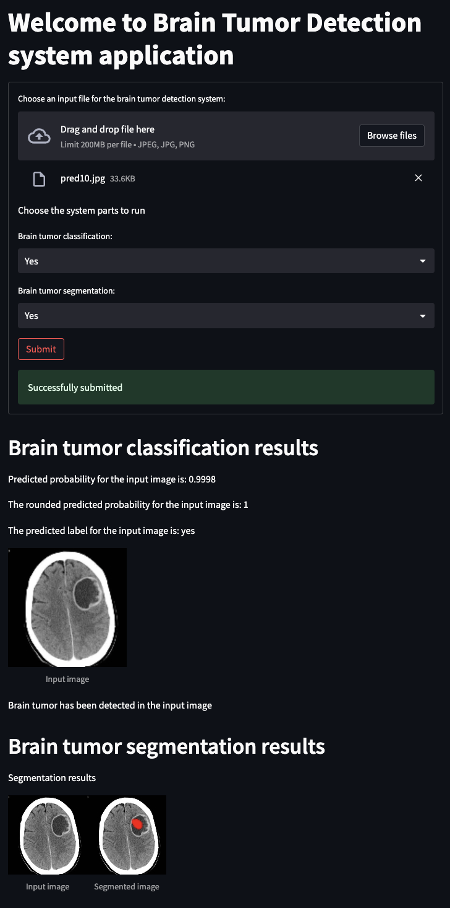


# Requirements and installation
- Python : `>=3.9.16, <3.11`
  - In order to run the project a virtual environment (e.g. conda) is needed with.
  - A conda env can be created with: `conda create --name btd_env python=3.9.16`.
  - Poetry needs to be installed with: `pip install poetry`
- Install requirements with:
  - `conda activate btd_env`
  - `cd brain-tumor-detection`
  - `poetry install` in the directory which contains `pyproject.toml` and `poetry.lock`.


# Technical details / Execution
ToDo: Update the paths and execution guidelines after the testing execution of the project.

## Classification (CNN)
<strong>Script files:</strong>  
- `/brain-tumor-detection/brain_tumor_detection/brain_tumor_classification/train.py` : CNN train flow script
- `/brain-tumor-detection/brain_tumor_detection/brain_tumor_classification/predict.py` : CNN predict flow script
- `/brain-tumor-detection/brain_tumor_detection/brain_tumor_classification/model.py` : CNN model

### Run training flow:  
`cd brain-tumor-detection`
`python3 brain_tumor_detection/brain_tumor_classification/train.py --dataset_path path/to_dataset/dataset --save_full_model True`

### Run predict flow:  
`cd brain-tumor-detection`
`python3 python3 brain_tumor_detection/brain_tumor_classification/predict.py --data_path path/to_data/dataset/pred --model_path path_to_model/output/classification_cnn/train/model_full.h5`

### Output files: 
The output files, i.e. models, experimentation results are not stored in the repo. However, the output after the brain tumor classification scripts is described below.  
Folder `brain-tumor-detection/brain_tumor_detection/brain_tumor_classification/output/train` :
- `history_fold_1.jpg`, `history_fold_2.jpg`, ..., `history_fold_9.jpg`, `history_fold_10.jpg` : Training history plots for all folds
- `model_fold_1.jpg`, `model_fold_2.jpg`, ..., `model_fold_9.jpg`, `model_fold_10.jpg` : Models for all folds from the experimentation phase
- `model_full.h5` : Model from full train
- `history.jpg` : Training history of full train
- `cm.jpg`, `normalized_cm.jpg` : Confusion matrices of classification results
- `le.pickle` : Label encoder for label classes
- `fold_num_all.pickle` : Fold number for all dataset samples
- `fname_folds_all.pickle` : Filenames for all folds samples
- `y_true_all.pickle` : True classes for all folds samples
- `y_pred_prob_all.pickle` : Predicted probabilities for all folds samples
- `y_pred_all.pickle` : Predicted classes for all folds samples

Folder `brain-tumor-detection/brain_tumor_detection/brain_tumor_classification/output/predict` :
- `y_pred_prob_all.pickle` : Predicted probabilities for input data
- `y_pred_all.pickle` : Predicted classes for input data

## Segmentation (U-Net)
### Generate masks
Create masks with:  
- `cd brain-tumor-detection`  
- `python3 brain_tumor_detection/brain_tumor_segmentation/generate_masks.py --dataset_path path/to_dataset/dataset/Br35H-Mask-RCNN`

The mask images are saved in the same folder as the original images with the suffix `_mask`. E.g. for an image filepath /path/to/image.jpg the respective mask image filepath is /path/to/image_mask.jpg.

<strong>Script files:</strong>
- `/brain-tumor-detection/brain_tumor_detection/brain_tumor_segmentation/generate_masks.py` : script that generates masks from dataset images and annotation data
- `/brain-tumor-detection/brain_tumor_detection/brain_tumor_segmentation/train.py` : UNET train flow script
- `brain-tumor-detection/brain_tumor_detection/brain_tumor_segmentation/model.py` : UNET model

### Run training flow:  
- `cd brain-tumor-detection`
- `python3 brain_tumor_detection/brain_tumor_segmentation/train.py --dataset_path path/to_dataset/dataset/Br35H-Mask-RCNN`

### Output files: 
The output files, i.e. models, experimentation results are not stored in the repo. However, the output after the brain tumor segmentation scripts is described below.  
Folder `brain-tumor-detection/brain_tumor_detection/brain_tumor_segmentation/output/train` :
- `history.jpg` : Training history of full train
- `model_unet.h5` : Trained model
- `evaluation_metrics.txt`: Evaluation results on testing data


# UI Application
### Run app
- `cd brain-tumor-detection`
- `streamlit run app/app.py --server.headless true -- --classification_model_path path/to_model/output/classification_tl/brain-tumor-classifiction.h5 --segmentation_model_path path/to_model/output/segmentation_resb/brain-tumor-segmentation.h5`

### Open app
After running the app, in a broswer enter the URL that is in the `Network URL` in the terminal.


# References
1. <a id="reference1"></a> Chattopadhyay, Arkapravo, and Mausumi Maitra. "MRI-based brain tumour image detection using CNN based deep learning method." Neuroscience informatics 2.4 (2022): 100060. [here](https://www.sciencedirect.com/science/article/piiS277252862200022X)
2. <a id="reference2"></a> Ronneberger, Olaf, Philipp Fischer, and Thomas Brox. "U-net: Convolutional networks for biomedical image segmentation." Medical image computing and computer-assisted intervention–MICCAI 2015: 18th international conference, Munich, Germany, October 5-9, 2015, proceedings, part III 18. Springer International Publishing, 2015. [here](https://arxiv.org/pdf/1505.04597)
